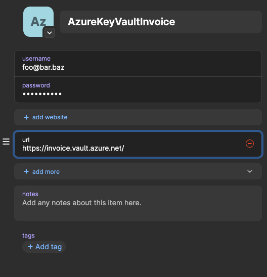

# rusty_psql

A wrapper around psql so information about host to connect to, database, password is retrieved from Azure Key Vault
and URL to Azure Key Vault from 1password thus avoiding storing passwords in cleartext locally.

Requires 1password  and Azure command line utilities installed locally, an Azure-subscription, a PostgreSQL-client.
Log in with `az login`.

Add an entry in 1password that can be accessed by the program. The path is formatted in Rust.

```
let op_path = format!("op://Production/AzureKeyVault{}/url", key);
```

An example of a key can be `Invoice` and the path becomes `op://Production/AzureKeyVaultInvoice/url`.




Create an Azure Key Vault named `invoice` and add the following secrets to Azure Key Vault:

```
db-host
db-name
db-pwd
db-user
db-domain
```

Change the path to suit your own requirement with the format `op://[vault-name]/[item]/[text-field]/[value]` in 1password.

Clone the repository, test, build and run with

```
cargo test
cargo build [--release]
./target/release/rusty_psql -n invoice
```

Install via `brew tap`.

```
brew tap kometen/rusty-psql
brew install rusty-psql
```

Build and run the container-image.

```
docker build -t rusty_psql:dev .
docker run --user rusty_psql_user rusty_psql:dev
```

The container will not inherit the environment from the shell so running from the container will not work.

I had much help from Claude. Used the editor zed at https://github.com/zed-industries/zed.
